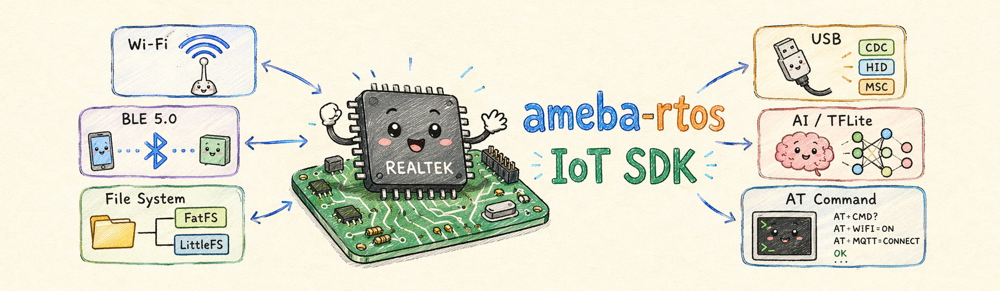

<div align="center">



# ameba-rtos

**The official IoT development framework for Realtek Ameba series chips, supporting Linux and Windows.**

[](https://aiot.realmcu.com/en/latest/rtos/index.html)
[](https://github.com/Ameba-AIoT/ameba-rtos/releases)
[](https://github.com/Ameba-AIoT/ameba-rtos/search?l=c)
[](LICENSE)
[](https://github.com/Ameba-AIoT/ameba-rtos/commits/master)<br>
[](https://github.com/Ameba-AIoT/ameba-rtos/actions/workflows/ameba_build_system.yml)
[](https://github.com/Ameba-AIoT/ameba-rtos/actions/workflows/ameba_build_system.yml)
[](https://gitee.com/ameba-aiot/ameba-rtos)

[English](README.md) · [中文版](README_CN.md) · [Documentation](https://aiot.realmcu.com/en/latest/rtos/index.html) · [Products](https://aiot.realmcu.com/en/product/index.html)

</div>

ameba-rtos is the official IoT development framework for Realtek Ameba series SoCs, running on FreeRTOS and supported on both Linux and Windows.

## 🔌 Supported Chips

| Chip      |          master          |     release/v1.2         |     release/v1.1         |     release/v1.0         |
|:--------- |:------------------------:|:------------------------:|:------------------------:|:------------------------:|
| RTL8730E  | ![alt text][supported]   | ![alt text][supported]   | ![alt text][supported]   | ![alt text][supported]   |
| RTL8726E  | ![alt text][supported]   | ![alt text][supported]   | ![alt text][supported]   | ![alt text][supported]   |
| RTL8721Dx | ![alt text][supported]   | ![alt text][supported]   | ![alt text][supported]   | ![alt text][supported]   |
| RTL8710E  | ![alt text][supported]   | ![alt text][supported]   | ![alt text][supported]   | ![alt text][supported]   |
| RTL8721F  | ![alt text][supported]   | ![alt text][supported]   | ![alt text][not-support] | ![alt text][not-support] |
| RTL8720E  | ![alt text][supported]   | ![alt text][supported]   | ![alt text][supported]   | ![alt text][supported]   |
| RTL8713E  | ![alt text][supported]   | ![alt text][supported]   | ![alt text][supported]   | ![alt text][supported]   |
| RTL8720F  | ![alt text][supported]   | ![alt text][not-support] | ![alt text][not-support] | ![alt text][not-support] |

[supported]: https://img.shields.io/badge/-supported-green "supported"
[not-support]: https://img.shields.io/badge/-not%20support-red "not support"

## 🏗️ Repository Structure

```text
ameba-rtos/
├── component/                  # SDK middleware and drivers
│   ├── soc/                    #   SoC-specific HAL and peripheral drivers
│   ├── wifi/                   #   Wi-Fi driver and API (STA / AP / monitor)
│   ├── bluetooth/              #   BLE / Classic BT stack and examples
│   ├── lwip/                   #   lwIP TCP/IP stack
│   ├── network/                #   Application-layer protocols (MQTT, HTTP, CoAP …)
│   ├── ssl/                    #   TLS/SSL (mbedTLS, GmSSL)
│   ├── audio/                  #   Audio framework                    [submodule]
│   ├── aivoice/                #   AI voice processing                [submodule]
│   ├── file_system/            #   VFS, FatFS, LittleFS, FTL, KV store
│   ├── usb/                    #   USB device and host drivers
│   ├── ethernet/               #   Ethernet driver and examples
│   ├── at_cmd/                 #   AT command framework (UART / SPI / SDIO / USB)
│   ├── dynamic_app/            #   Dynamic application loading framework
│   ├── application/speechmind/ #   SpeechMind application             [submodule]
│   ├── os/                     #   FreeRTOS kernel and OS wrapper
│   ├── ota/                    #   Over-the-air update framework
│   ├── ui/                     #   LVGL graphics library               [submodule]
│   └── tflite_micro/           #   TensorFlow Lite for Microcontrollers [submodule]
├── example/                    # Ready-to-run application examples
│   ├── wifi/                   #   Wi-Fi station, AP, roaming, CSI …
│   ├── wificast/               #   WifiCast (control, OTA, security …)
│   ├── network_protocol/       #   TCP/UDP, MQTT, HTTP, WebSocket, CoAP …
│   ├── ssl/                    #   TLS client / server examples
│   ├── peripheral/             #   GPIO, SPI, I2C, UART, PWM, ADC …
│   ├── storage/                #   VFS, KV, SD card, USB mass storage …
│   ├── usb/                    #   USB device and host class examples
│   ├── ethernet/               #   Ethernet examples
│   ├── atcmd_host/             #   AT command host examples (UART/SPI/SDIO/USB)
│   ├── ota/                    #   OTA update examples
│   ├── mp_app_integration/     #   MP app integration example
│   ├── cJSON/                  #   cJSON usage example
│   └── xml/                    #   XML usage example
├── tools/                      # Host-side utilities
│   ├── ameba/                  #   ImageTool, Flash tool, Monitor, MCP server …
│   └── scripts/                #   Build scripts, image processing
├── cmake/                      # CMake build system (toolchains, flags, Kconfig)
├── ameba.py                    # Unified CLI: build / flash / monitor / menuconfig
└── env.sh / env.bat            # Toolchain environment setup (Linux / Windows)
```

## ✨ Key Features

- **Multi-core support** — heterogeneous CPU configurations (KM4 + KR4 / KM4 + CA32) with IPC
- **Wi-Fi** — STA, AP, Wi-Fi Direct, Enterprise (802.1X), CSI, fast connect, roaming, NAT repeater, WifiCast, R-Mesh, NIC mode (WHC: Linux / RTOS / Zephyr / STM32 host)
- **Bluetooth** — BLE 5.0 GAP/GATT and Classic BT, co-existence with Wi-Fi
- **Security** — mbedTLS 3.x, GmSSL, Secure Boot, TrustZone
- **File systems** — FatFS, LittleFS, FTL, VFS abstraction with SD card and USB MSC
- **USB** — Device (CDC-ACM, HID, MSC, UAC, vendor) and Host classes
- **OTA** — dual-bank OTA over HTTP/HTTPS
- **AT Command** — AT command framework over UART / SPI / SDIO / USB
- **Audio** — audio framework with codec drivers *(XDK)*
- **AI Voice** — AI voice processing framework *(XDK)*
- **TFLite Micro** — TensorFlow Lite Micro for on-device inference *(XDK)*
- **SpeechMind** — SpeechMind application integration *(XDK)*
- **UI** — LVGL graphics library integration *(XDK)*
- **Dynamic App** — runtime dynamic application loading

## 📚 Documentation

Documentation for the latest version: [FreeRTOS SDK and User Guide](https://aiot.realmcu.com/en/latest/rtos/index.html).

For more information on the Ameba series chips, visit the [product page](https://aiot.realmcu.com/en/product/index.html).

## 📥 SDK Download

We provide two download options depending on your needs:

**Basic SDK** — core SDK without submodules, suitable for Wi-Fi, BT, networking and peripheral development:

```bash
git clone https://github.com/Ameba-AIoT/ameba-rtos.git
```

**XDK (Extended)** — full SDK including all submodules, required for audio, AI voice, UI and TFLite Micro:

```bash
git clone --recurse-submodules https://github.com/Ameba-AIoT/ameba-rtos.git
```

If you cloned without submodules and need them later:

```bash
git submodule update --init --recursive
```

> The submodule components (`audio`, `aivoice`, `ui`, `tflite_micro`, `application/speechmind`) are hosted in separate repositories and only needed for the corresponding features.

## 🚀 Quick Start

We support the following two methods for configuring the build environment:

### Using the VS Code Extension Plugin

The Ameba extension plugin is developed based on Cline and fully compatible with all native Cline features. It provides enhanced support specifically for Realtek Ameba series chips, including:

* Automatic environment checking and installation
* Automated SDK configuration
* One-click project compilation
* Convenient flashing tools
* Integrated serial port monitoring

Refer to the [VS Code User Guide](https://aiot.realmcu.com/en/latest/tools/vscode/index.html) for plugin installation instructions.

### Manual Build Environment Configuration

If you prefer to configure the build environment manually, refer to the [FreeRTOS SDK User Guide](https://aiot.realmcu.com/en/latest/rtos/sdk/index.html) and follow the steps below.

**1. Set up the SDK environment**

```bash
source env.sh   # Linux
env.bat         # Windows
```

> `env.sh` downloads the cross-toolchain prebuilts on the first run (requires network); subsequent runs reuse them.

**2. Select the target chip and configure the project**

```bash
ameba.py soc <soc_name>   # e.g. RTL8721Dx, RTL8730E
ameba.py menuconfig       # open the Kconfig menu
```

**3. Build**

```bash
ameba.py build
```

**4. Flash the firmware**

```bash
ameba.py flash -p <PORT> -b <BAUDRATE> -i <BIN_FILE> <START_ADDR> <END_ADDR>
```

**5. Monitor the serial port**

```bash
ameba.py monitor -p <PORT> -b 1500000
```

## 🌐 Accelerate with Gitee

For users who can access [Gitee](https://gitee.com), we recommend downloading the Gitee mirror [ameba-rtos](https://gitee.com/ameba-aiot/ameba-rtos) to improve download speed if GitHub is slow.

## 💬 Feedback

* For questions or suggestions during development, visit [Real-AIOT Forum](https://forum.real-aiot.com/).
* For bugs or feature requests, [check the GitHub Issues](https://github.com/Ameba-AIoT/ameba-rtos/issues). Please check existing issues before opening a new one.
