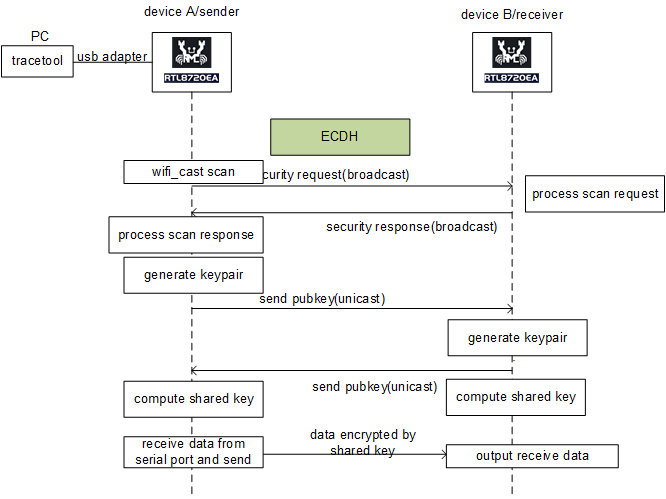

# Security Example

This example demonstrates how to use the WIFI-CAST data to configure shared key between devices. The data transmited will be encrypted automatically once the shared key is installed.

The basic functionality is same as uart, but just have this extra security enhancement.

## Functionality

One device receives data through the user-defined serial port and send the encrypted data to other devices through WIFI-CAST data. Other devices will output the data through the loguart when receive the data.

The security workflow is as follows:


## Setup Enviornment

At least two Ameba development boards are needed. Choose one board to connect user-defined serial port with a USB-UART adapter and works as the sender, and another board works as the receiver.

## User-defined Frame Format

Config the user-defined data header in User Payload field.
|   Type   |   Len   | 
|:--------:|:-------:|
|  2 bytes | 2 bytes |
* Type: The Type field is set to indicate the WIFI-CAST security data.
    ```
    #define WIFI_CAST_UART_DATA                     BIT(13)
    #define WIFI_CAST_SCAN_REQUEST                  BIT(12)
    #define WIFI_CAST_SCAN_RESPONSE                 BIT(11)
    #define WIFI_CAST_SEC_PUBKEY_EXCHANGE_REQUEST   BIT(10)
    #define WIFI_CAST_SEC_PUBKEY_EXCHANGE_RESPONSE  BIT(9)
    ```
* Len: The Len field is set as the length of security data.

## How to Use the Example

### Step 1: Config the Serial Port

The default PIN in the example is set as below, change them if necessary.
```
#define UART_TX_PIN    PA_28
#define UART_RX_PIN    PA_29
```
The default baudrate is set to 1500000 bps, change it if necessary.
```
#define UART_BAUD_RATE 1500000
```
Ther default buffer size is set to 200, change it if necessary.
```
#define UART_RX_BUF_SZ	200
```

### Step 2: Connect the Serial Port

Choose one board as the sender and connect the user-defined serial port with PC serial terminal through an USB-UART adapter.

### Step 3: Build & Flash

1. Navigate to the project directory according to the chip you use. For GCC enviornment, type command `./build.py -a wificast_security` to compile the example.
2. Download the image into flash for both sender and receiver.

### Step 4: Run Sender and Receiver

1. Reset both sender and receiver.
2. Then sender inputs shell command to start scan and send scan request.
    ```
    wificast scan
    ```
    * Output sample from the sender:
    ```
    [11:02:07:691]wifi_cast scan
    [11:02:14:762][example_main-I] example_security_scan_task, scan info num: 1
    [11:02:14:988][example_main-I] example_security_scan_task, generate_keypair ok
    [11:02:14:988][WIFI CAST-I] wifi_cast_add_node, node: 00:e0:4c:00:03:c2, set encrypt: 0
    [11:02:14:988][WIFI CAST-I] wifi_cast_add_node, 00:e0:4c:00:03:c2 add success
    [11:02:14:993][WIFI CAST-I] wifi_cast_get_mac_id, 00:e0:4c:00:03:c2, macid: 0
    [11:02:14:994][example_main-I] example_security_scan_task, send pubkey exchange to00:e0:4c:00:03:c2
    [11:02:15:279][example_main-I] example_security_pubkey_exchange_response_cb, recv pubkey exchange from00:e0:4c:00:03:c2
    [11:02:15:398][WIFI CAST-I] wifi_cast_add_node, node: 00:e0:4c:00:03:c2, set encrypt: 1
    [11:02:15:401][WIFI CAST-I] wifi_cast_add_node, 00:e0:4c:00:03:c2 is already exist
    [11:02:15:401][WIFI CAST-I] wifi_cast_set_key add, mac:00:e0:4c:00:03:c2
    ```
    * Output sample from the receiver:
    ```
    [11:02:07:677][example_main-I] example_security_scan_request_cb, recv scan request from src_mac: 00:e0:4c:00:03:5d
    [11:02:07:690][WIFI CAST-I] wifi_cast_add_node, node: 00:e0:4c:00:03:5d, set encrypt: 0
    [11:02:07:691][WIFI CAST-I] wifi_cast_add_node, 00:e0:4c:00:03:5d add success
    [11:02:07:691][example_main-I] example_security_scan_request_cb, send response success
    [11:02:15:000][example_main-I] example_security_pubkey_exchange_request_cb, recv pubkey exchange from00:e0:4c:00:03:5d
    [11:02:15:273][example_main-I] example_security_pubkey_exchange_request_cb, generate_keypair ok
    [11:02:15:273][WIFI CAST-I] wifi_cast_get_mac_id, 00:e0:4c:00:03:5d, macid: 0
    [11:02:15:273][example_main-I] example_security_pubkey_exchange_request_cb, send pubkey exchange to00:e0:4c:00:03:5d
    [11:02:15:412][WIFI CAST-I] wifi_cast_add_node, node: 00:e0:4c:00:03:5d, set encrypt: 1
    [11:02:15:416][WIFI CAST-I] wifi_cast_add_node, 00:e0:4c:00:03:5d is already exist
    [11:02:15:416][WIFI CAST-I] wifi_cast_set_key add, mac:00:e0:4c:00:03:5d
    ```
3. The sender inputs data through the user-defined serial port.

## Note
The role of `sender` and `receiver` will be on the devices at the same time. When user connect user-defined serial port with a USB-UART adapter on one device, this device acts as sender and sends data to other devices. The device receives the data will act as receiver. 

Both sender and receiver can start scan.
