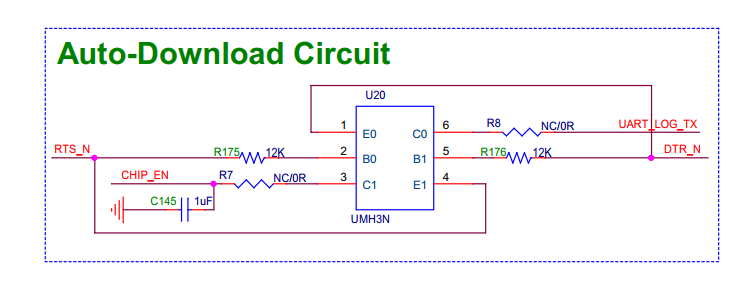

# Hardware-side troubleshooting (Ameba MCU dev boards)

> **Audience**: anyone (user or AI agent) who hits a reset / download /
> serial-port failure that the SDK-side logs cannot fully explain.
>
> **Loading**: this document is exposed as MCP resource `debug://hardware`.
> It is **not** loaded into the system prompt by default — fetch it
> explicitly when an error envelope points here.

---

## §1 PL2303 USB-to-UART driver requirement

**The auto-download circuit relies on RTS/DTR signal integrity. Driver versions
older than 5.2.x mis-handle these lines and break automatic download / reset.**

### Symptoms of a bad driver

- `RESET_FAILED` even though the board is plugged in and nothing else holds the port.
- `flash_firmware_tool` returns "boot mode wrong" / "ROM did not enter download mode".
- The board boots normally on power-up but never enters download mode via the
  software handshake.

### How to check the installed driver

| OS | Command |
|---|---|
| Windows | Device Manager → Ports (COM & LPT) → Prolific USB-to-Serial → Properties → Driver tab. **Required ≥ 5.2.x.** |
| Linux   | `dmesg \| grep -i pl2303` after plugging the cable; the kernel `pl2303` module must be present and recent. |

If the version is older, install the official Prolific 5.2.x driver. After
upgrading, unplug and re-plug the USB cable.

---

## §2 Auto-download circuit (UMH3N + RTS/DTR)

The reference circuit on Realtek dev kits uses a **UMH3N** dual-NPN array
to translate RTS/DTR into the chip's `CHIP_EN` (reset) and `UART_LOG_TX`
(BOOT trap) lines.

### Components

| Component | Spec | Connection | Role |
|---|---|---|---|
| U20 | UMH3N | Core logic | Dual-NPN array, processes input signals |
| R175 | 12 kΩ | RTS_N → U20 pin 1 | Stabilises RTS input |
| R176 | 12 kΩ | DTR_N → U20 pin 4 | Stabilises DTR input |
| R7 | — | U20 pin 2 → CHIP_EN | Current limit on CHIP_EN output |
| R8 | — | U20 pin 5 → UART_LOG_TX | Current limit on UART_TX output |
| C145 | 1 µF | R7 → GND | Filter; keeps CHIP_EN stable |

### Signal definitions

**Inputs** (from PL2303):

| Signal | Meaning |
|---|---|
| RTS (Request To Send) | Sender requests data send |
| DTR (Data Terminal Ready) | Receiver ready to accept |

**Outputs** (to SoC):

| Signal | Meaning |
|---|---|
| CHIP_EN | Chip-enable / reset. Low = held in reset; high = running. |
| UART_LOG_TX | Doubles as **BOOT trap pin** during reset — selects boot mode. |

### Logic table

| DTR | RTS | Effect |
|---|---|---|
| 0 | 1 | Pull BOOT pin low |
| 1 | 0 | Pull RESET pin low |
| DTR == RTS | Circuit inactive (so a normal terminal cannot accidentally reset the board) |

### Auto-download sequence (Image Tool drives PL2303)

| Step | DTR | RTS | Effect | Goal |
|---|---|---|---|---|
| 1 idle    | 1 | 1 | nothing                  | Tool not running / idle |
| 2 prep    | 0 | 1 | Q1 on, BOOT pulled low   | Tell chip "next boot = download" |
| 3 reset   | 1 | 0 | Q2 on, CHIP_EN pulled low | Reset the chip |
| 4 release | 0 | 1 | Q2 off (CHIP_EN rises via C145/R7), Q1 still pulling BOOT low | BOOT sampled low at boot → enters download mode |
| 5 transfer| 1 | 1 | Q1, Q2 both off          | Begin firmware transfer over TX/RX |

### Custom boards may need manual reset

If your board does **not** match this reference circuit (different IC, no
auto-download wiring, or RTS/DTR not routed at all), automatic reset and
download will NOT work even with a healthy PL2303 driver. In that case
you must hold the **BOOT** button, press and release the **RST** button,
then release **BOOT** before the flash tool starts the transfer — the
exact same physical operation the auto-download circuit performs.

---

## §3 Common failure patterns

### `RESET_FAILED`

1. Driver version (§1).
2. Power: board not getting 5 V from USB (try a different cable / port).
3. RTS/DTR not actually wired to the reset circuit on this board (custom
   designs that pull RST/BOOT to dedicated buttons only — see §2 last
   paragraph).
4. Another process is holding the port — check
   `list_serial_ports_tool().ports[*].holder`.

### Flash failure ("boot mode wrong" / `FLASH_HW_ERROR`)

1. Auto-download sequence aborted — usually a §1 driver issue.
2. Flash write protection enabled in OTP (rare on dev boards, typical on
   shipping units; check chip security state).
3. Baud-rate mismatch: `board_info.json5 → defaults.baudrate` set wrong
   for this SoC. Default 1500000 works for all current Ameba SoCs.
4. Cable too long / too thin / damaged: USB-UART becomes flaky at
   1.5 Mbaud over a 2 m unshielded cable. Try ≤ 1 m / shielded.

### Serial port not visible after plug-in

1. PL2303 driver missing entirely (§1).
2. On Linux, check `dmesg` after re-plug — kernel must enumerate the device.
3. udev / `dialout` / `tty` group membership: user must be in `dialout`
   on Debian/Ubuntu to open `/dev/ttyUSB*` without root.
4. Windows: try a different USB port — some hubs do not pass USB-CDC
   reliably.

### Remote (network) board unreachable

1. `AmebaRemoteService` is not running on the host machine.
2. Firewall blocking TCP 58916.
3. host / port / password mismatch in `board_info.json5 → boards.<alias>.remote`.

---

## §4 Error code → section index

| Code | Where to look |
|---|---|
| `BOARD_CONFIG_MISSING` / `PROJECT_CONFIG_MISSING` | `docs/board_info.md` and `docs/project_info.md` |
| `ALIAS_REQUIRED` / `ALIAS_NOT_FOUND` | error envelope's `configured_aliases` field |
| `PORT_NOT_VISIBLE` | §3 "Serial port not visible" |
| `REMOTE_UNREACHABLE` | §3 "Remote (network) board unreachable" |
| `RESET_FAILED` / `RESET_TEST_FAILED` | §1 driver, §2 circuit, §3 RESET_FAILED |
| `FLASH_HW_ERROR` / boot mode wrong | §1 driver, §3 Flash failure |
| `BOOT_CRASHED` | not a hardware issue — check `wait.data` for the register dump and reproduce |

---

## §5 When to suspect "it's the hardware, not the SDK"

Reach for this document — instead of bisecting the SDK — when:

- A `quick_test_tool` that worked yesterday now hits `RESET_FAILED`
  with no SDK changes (driver was auto-updated? new USB hub?).
- The same code that flashes fine on board A fails on board B with the
  same SoC (board variants / cables differ).
- `env_pre_check_tool` reports the port as visible and not held, but
  reset still fails (likely §1 or §2).
